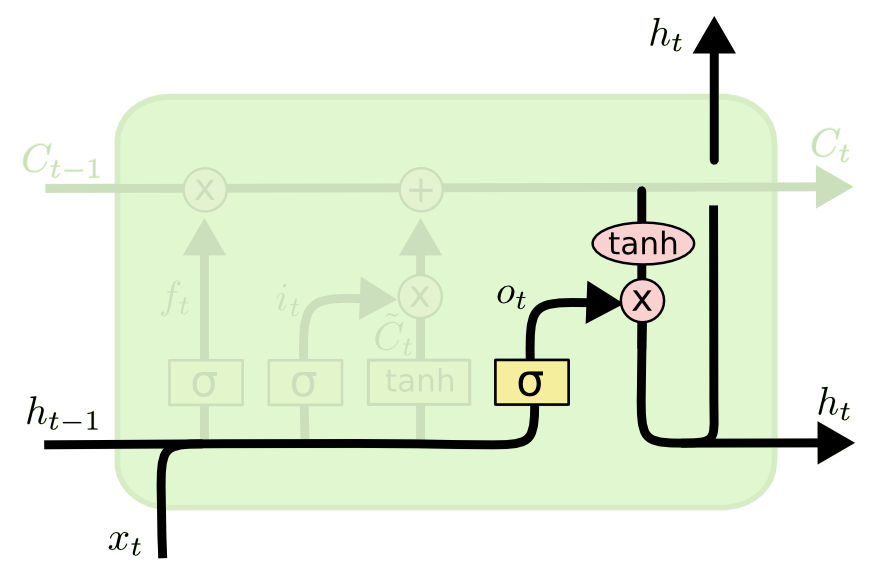
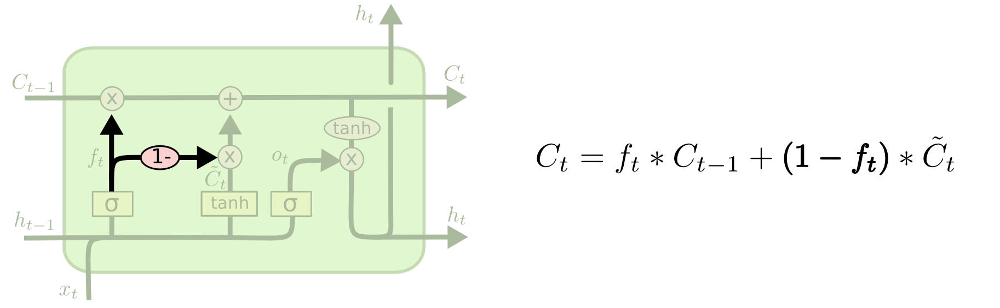

# Understanding LSTM Networks

# Chris Olah blog

source: [http://colah.github.io/posts/2015-08-Understanding-LSTMs/](http://colah.github.io/posts/2015-08-Understanding-LSTMs/)

- Traditional NN can't use its previous reasoning to inform later ones. RNNs have memory.
- RNNs can be unrolled to form a traditional neural network.
- In the example `I grew up in France… I speak fluent French` for the network to fill in `french` it needs to have the context of `france`.
- The more distance from the context, the tougher it is to fill in. Theoretically vanilla RNN can do this, with right weights. But unable to learn these weights.

## Structure of LSTM

- Cell state
  - Runs from left to right
- Gates control information flow
  - forget gate `f_t`:
	- Switches on or off the cell state
	-  sigmoid of `h_{t-1}` and `x_t`
  - input gate `i_t`:
	- Used to determine which cell states to update
	- Also a sigmoid of `h_{t-1}` and `x_t`
  - Candidate cell state value `Ç_t`:
	- new cell state calculated by `tanh` layer of `h_{t-1}` and `x_t`
	- We can update new cell state: `C_t = f_t * C_{t-1} + i_t * Ç_t`
  - Output gate `o_t`:
	- Used to control which cell states affect `h_t`
	- sigmoid of `x_t` and `h_{t-1}`
  - Output `h_t`:
	- The cell state `C_t` is passed through a `tanh` layer
	- Then the states are selected using `o_t`
	- `h_t = o_t * tanh(C_t)`

## Variants of LSTM

- Peephole LSTM
  - The gates look at the cell state to make decisions every layer

- Coupled LSTM
  - The forget and input gates are coupled together. Input gates are the negative of the forget gates.

- GRU
  - Simplifies LSTM
  - Combines the cell state and output
  - Combines the forget and input gate into a single update gate

## Conclusion and Further reading

- LSTM was a big step, Attention might be the next big step
- Show, Attend and Tell: Neural Image Caption Generation with Visual Attention - Xu et al
- Grid Long Short-Term Memory - Kalchbrenner et al
- DRAW: A Recurrent Neural Network For Image Generation - Gregor et al
- LEARNING STOCHASTIC RECURRENT NETWORKS - Bayer et al
- Depth-Gated Recurrent Neural Networks - Yao et al
- A Clockwork RNN - Koutnik et al
- LSTM: A Search Space Odyssey - Greff et al
- An Empirical Exploration of Recurrent Network Architectures - Jozefowicz et al